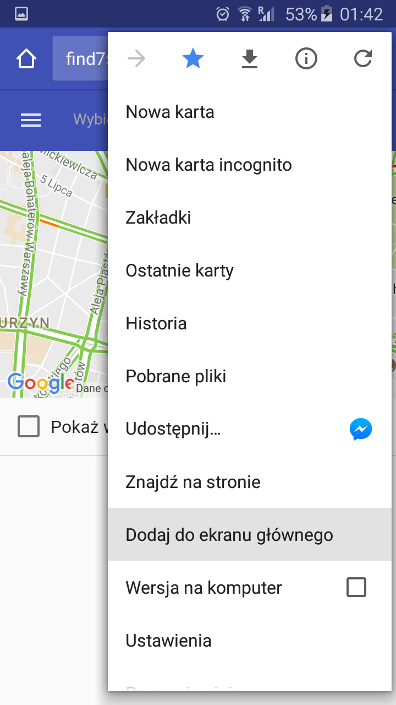

# Find75

### [Link to App](https://find75.azurewebsites.net)

App which shows current position of Szczecin's buses.

It bases on data from [ZDITM](http://www.zditm.szczecin.pl/) and shows position of buses which have GPS.

**Important!** Some older buses haven't buildin GPS, so app won't show their positions.

# Add shortcut to homescreen

- Click on Menu
- Choose 'Add to homescreen'
- Press 'Add'
- Done!

## Frameworks

- **nodejs** - https://nodejs.org/
- **expressjs** - http://expressjs.com/
- **angular 1** - https://angularjs.org/
- **material angular** - https://material.angularjs.org/

## Feedback
All bugs, feature requests, pull requests, feedback, etc., are welcome. [Create an issue.](https://github.com/nnaisur/find75/issues)

## Quick Start for developers

- `git clone git@github.com:nnaisur/find75.git` or [Download](https://github.com/nnaisur/find75/archive/master.zip)
- `cd find75`
- `npm install` - node modules for node app
- `cd assets`
- `npm install` - node modules for angular
- `cd ..`
- `node server.js` - start app

## TODO
- ~~install angular~~
- ~~get data from [ZDITM](http://www.zditm.szczecin.pl/) and parse it~~
- ~~gui with select which allow to show postion of current station~~
- gui with select which allow to show postion of current line
- ~~add google-map or open street map~~
- show selected buses on map
- ~~show buses based on bus station~~
